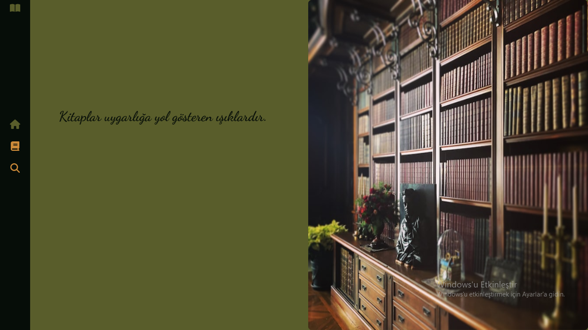
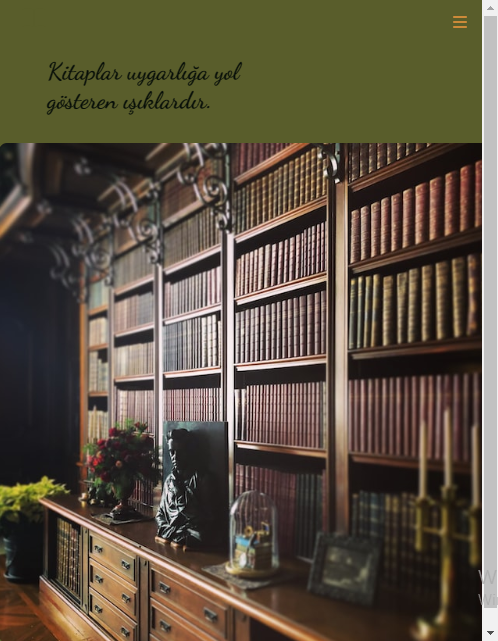
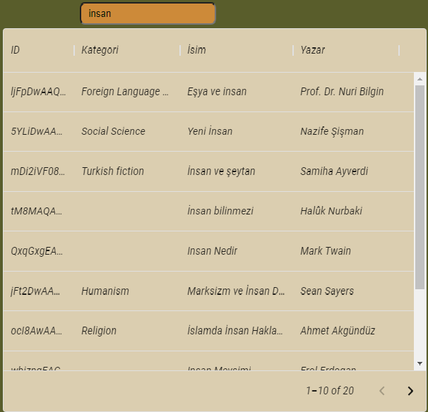

# Search Book App /Kitap Arama Uygulaması
 
 Projeyi oluştururken iki branchta çalıştım.İlk olarak develop branchında geliştirme yaptım ardından main branchında son halini repoya ekledim ve branchları merge ettim.Branchlarda her değişiklik yaptığımda commit mesajı eklemeye özen gösterdim.
 Bu projede farklı bir navbar stili olarak sidebar kullandım ve sidebarı hamburger menu halinde responsive uyumlu hale getirdim.Sidebardaki ikonlara react-router-dom özelliği olan linkleri ekledim.
 
 
 
 
 
Book search uygulamasında googleapi.com dan axios ile aldığım books apisini kullandım.Projemin books sayfasında search componentinde girilen inputa göre datayı filtreleyerek mui-datagrid ile tablo şeklinde her sayfada 10 kitap olacak şekilde 2 sayfada gösterdim.

Search sayfasında ise girilen input sonucunda filtereleme yaparak kitap görsellerini ve üzerinde tıklanınca ilgili görseli ve detay sayfasını ekledim.

## Demo
https://booksearch-app.netlify.app/

## API
https://www.googleapis.com/books

## İkonlar
font awesome

## Kütüphaneler 
+ React
+ react-router-dom 6.4v 
+ axios 
+ mui-datagrid

## Stil
SCSS 

